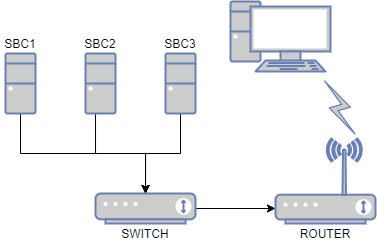

# Ansible PlayCluster

<!-- Project images -->


<qoute>
ansible, ansible-playbook cluster using 3D printed structure.
</qoute> 
:computer: :computer: :computer:

---

## What is does

- Update the system.
- Add your SSH key.
- Install packages you normally use.

### Network diagram:

<div style="text-align:center"></div>

---

## Software :cd:

### Requirements

- Ansible, Nmap

  ```shell
  sudo apt install python3 python3-pip nmap -y
  pip3 install ansible
  ```

- Clone this repository. :dancers:

  ```shell
  git clone https://github.com/yeyeto2788/ansible-playcluster.git
  ```

- Create an SSH key file.

```shell
ssh-keygen -t ed25519 -c "ansible workstation key"
```

### SBC preparation

- Burn the image on the SD card ([More Info](https://www.raspberrypi.org/documentation/installation/installing-images/))
- Connect the switch to the network and the boards to the switch.
- Power up the boards and the switch. :electric_plug:
- Find the IP assigned to the boards. :mag:

  ```shell
  nmap -sT 192.168.0.1/24
  ```

- Log in through SSH to each board and change the hostname of each machine. e.g: `ssh root@192.168.0.110`.
- Change hostname (Optional)
- Assign an static IP address to each board.

### Getting the boards ready

- Get needed roles for this playbook.

  ```shell
  ansible-galaxy install --roles-path ./roles -r requirements.yml
  ```

- Move the software directory.

  ```shell
  cd software/
  ```

- Edit the variables on the `vars/setup_variables.yaml` file.

- Check that it works as expected. :warning:

  ```shell
  ansible-playbook main.yaml -kK --check
  ```

- Execute the playbook. :heavy_check_mark:

  ```shell
  ansible-playbook main.yaml -kK
  ```

## Tips: :penguin:

- Execute a command in all servers

  ```shell
  ansible all -m shell -a "free -h" -kK
  ```

- Targeting to one server or group using the **`--limit`** argument.

  ```shell
  ansible all -m shell -a "free -h" --limit master_node -kK
  ```

- Copy SSH keys to the nodes.

  ```shell
  ssh-copy-id -i <path_to_key_file> 192.168.0.110
  ```

---

## Hardware :hammer:

The following items are the ones I used for this build. For more info on the hardware you head to [this](./docs/hardware.md) document.

| Qty | Part                     |
| :-: | :----------------------- |
|  1  | Unmanaged network switch |
|  3  | Single board computer    |
|  4  | Ethernet cables          |
|  1  | 5V Power supply          |
|  4  | 5mm x 100mm screw        |
|  4  | 5mm nut                  |
| 12  | 3mm x 8mm screw          |
| 12  | 3mm locking nut          |
|  1  | Set of 3D printed parts  |

**Notes:**

- I used [this](https://eu.dlink.com/uk/en/products/go-sw-5e) network switch which is unmanaged but I guess you can use any switch you like as long as it has enough ports for you boards.
- I decided to go with 3mm screws since where the ones I had.
