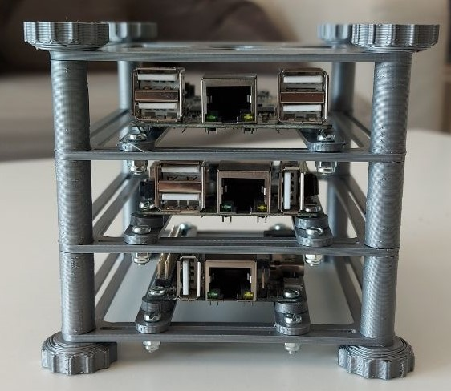

# Ansible PlayCluster

<!-- Project images -->
<div align=center>


> ansible, ansible-playbook cluster using 3D printed structure.

:computer: :computer: :computer:

</div>

---

## What this does

- Update the system.
- Add your SSH key.
- Install packages you normally use.
- Install Docker
- Setup Kubernetes cluster.

---

## Software :cd:

### Requirements

In order to use ansible and follow the steps on this short guide you need to setup the boards, install the following requirements, download this repository and create an SSH key file.

- Setup the boards (Follow this [guide](./docs/boards_setup.md))

- Install requirements.

  ```shell
  sudo apt install python3 python3-pip python3-setuptools nmap sshpass -y
  pip3 install ansible
  ```

- Clone this repository. :dancers:

  ```shell
  $ git clone https://github.com/yeyeto2788/ansible-playcluster.git
  ```

- Go to the `software` folder within the cloned repository.

  ```shell
  $ cd ./ansible-playcluster/software/
  ```

- Create an SSH key file. :key:

  ```shell
  $ ssh-keygen -t ed25519 -C "ansible workstation key"
  ```

- Get needed roles for this playbook.

  ```shell
  $ ansible-galaxy install --roles-path ./roles -r requirements.yaml

  Starting galaxy role install process
  - downloading role 'k3s', owned by xanmanning
  - downloading role from https://github.com/PyratLabs/ansible-role-k3s/archive/v1.16.0.tar.gz
  - extracting xanmanning.k3s to /home/yeyeto2788/workspace/ansible-playcluster/software/roles/xanmanning.k3s
  - xanmanning.k3s (v1.16.0) was installed successfully
  ```

- Edit the variables on the `vars/setup_variables.yaml` file.

- Check that it works as expected. :warning:

  ```shell
  $ ansible-playbook main.yaml -kK --check
  ```

- Execute the playbook. :heavy_check_mark:

  ```shell
  $ ansible-playbook main.yaml -kK
  ```

## Tips: :penguin:

- Execute a command in all servers

  ```shell
  ansible all -m shell -a "free -h" -kK
  ```

- Targeting to one server or group using the **`--limit`** argument.

  ```shell
  ansible all -m shell -a "free -h" --limit master_node -kK
  ```

- Copy SSH keys to the nodes.

  ```shell
  ssh-copy-id -i <path_to_key_file> 192.168.0.110
  ```

---

## Hardware used :hammer:

The following items are the ones I used for this build. For more info on the hardware you head to [this](./docs/hardware.md) document.

| Qty | Part                     |
| :-: | :----------------------- |
|  1  | Unmanaged network switch |
|  3  | Single board computer    |
|  4  | Ethernet cables          |
|  1  | 5V Power supply          |
|  4  | 5mm x 100mm screw        |
|  4  | 5mm nut                  |
| 12  | 3mm x 8mm screw          |
| 12  | 3mm locking nut          |
|  1  | Set of 3D printed parts  |

**Notes:**

- I used [this](https://eu.dlink.com/uk/en/products/go-sw-5e) network switch which is unmanaged but I guess you can use any switch you like as long as it has enough ports for you boards.
- I decided to go with 3mm screws since where the ones I had.
- I bought a 5mm screw rod and cut it since I couldn't find long screws.
