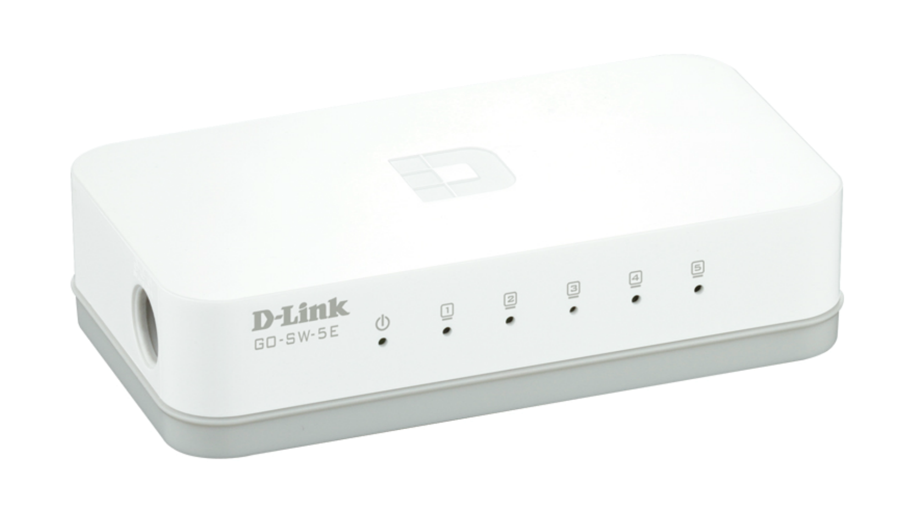

# Hardware used on the build

## SBC1: Orange Pi one

Link to product page [here](http://www.orangepi.org/orangepione/)

---

## SBC2: Orange Pi PC

Link to product page [here](http://www.orangepi.org/orangepipc/)

---

## SBC3: Orange Pi PC PLUS

Link to product page [here](http://www.orangepi.org/orangepipcplus/)

---

## SWITCH: 5 ports GO-SW-5E

Link to product page [here](https://eu.dlink.com/uk/en/products/go-sw-5e)

---

## 5V 4A Power Supply

I used a regular 5 volts 4 Amperes power supply bought on china, you can also use USB chargers for the boards but it might make the build a bit bigger.

---

## 3D Printed Parts

To replicate the cluster I have built you need the following pieces.

| Qty | Part                                                 |                        3D view                        |
| :-: | :--------------------------------------------------- | :---------------------------------------------------: |
|  4  | [Frame](../hardware/STL/frame.stl)                   |                    |
| 12  | [PCB standoff](../hardware/STL/pcb_standoff.stl)     |      |
|  8  | [Frame standoff](../hardware/STL/frame_standoff.stl) |  |
|  6  | [Board Holder](../hardware/STL/x_holder.stl)         |          |

#### Print settings

- 0.25 Layer height.
- 4 Walls.
- 20% Infill.

**Notes:**

- 1 Frame per board (You add an additional frame for the top)
- 4 PCB Standoff per board
- 4 Frame Standoff per frame
- 2 Board Holder per board.
